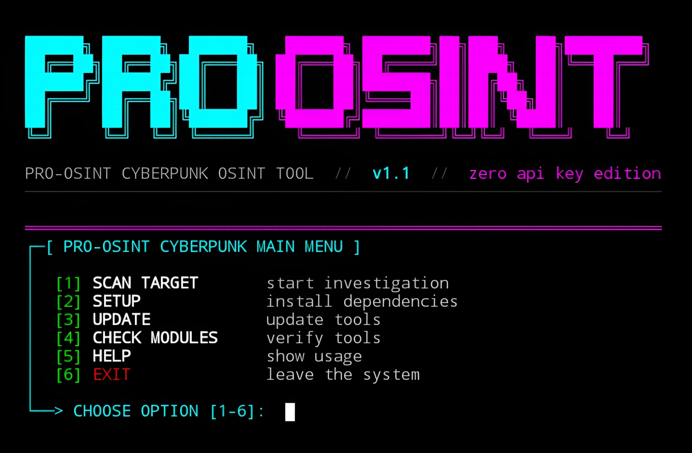

# PRO-OSINT


<p align="center">
  <strong>Cyberpunk OSINT Framework · Zero API Keys · 40+ Modules</strong><br>
  <em>"The grid never forgets, but you can always disconnect." – Mr.X</em>
</p>

## Introduction
**PRO-OSINT** is a powerful, all-in-one Open Source Intelligence (OSINT) tool designed for **reconnaissance**, **digital footprint analysis**, and **automated intelligence gathering**. With a sleek **cyberpunk neon interface**, it packs **40+ integrated modules** covering usernames, emails, phone numbers, names, and domains – without requiring any paid APIs. The engine works flawlessly on **Linux**, **Termux (Android)**, and **Windows**, and is built for both interactive menu use and headless CLI automation.

## Installation
```bash
$ pkg update -y && pkg upgrade -y 
$ pkg install git python -y    
$ git clone https://github.com/Whomrx666/Pro-osint.git
$ cd Pro-osint
$ python3 install.py

```
## Run manually
```
$ python3 pro-osint.py
```
## CLI usage {non-interactive}
```
$ python3 pro-osint.py johndoe                 # username scan (standard mode)
$ python3 pro-osint.py -m deep johndoe         # deep scan (more modules)
$ python3 pro-osint.py -t email john@doe.com   # force email type
$ python3 pro-osint.py -r sherlock, johndoe    # run specific modules
$ python3 pro-osint.py -P johndoe              # auto investigate discovered pivots
$ python3 pro-osint.py --setup                 # install all dependencies
$ python3 pro-osint.py --check                 # verify tool availability
```

## Features
- **40+ Integrated Modules** – Username (Sherlock, Maigret, Instagram, Facebook, TikTok, etc.), Email (Holehe, Gravatar, GitHub by email), Phone (Ignorant, PhoneInfoga, phone_meta), Domain (WHOIS, DNS), Name dorks and more.
- **Zero API Keys** – Native scrapers, public archives (Wayback Machine, Pastebin dumps), and free CLI tools – no paid subscriptions.
- **Termux Optimized** – Works out of the box on Android (no root required).
- **Cyberpunk UI** – Neon colors, animated loading sequence, author info card, and interactive menu.
- **Smart Target Detection** – Automatically identifies usernames, emails, phone numbers, names, and domains.
- **Pivot Automation** – Extracts new emails, usernames, or names from results and recursively investigates them (-P flag).
- **Rate Limiting & Caching** – Avoids IP bans and speeds up repeated searches.
- **Multi Format Reports** – Export full investigation as JSON, TXT, or HTML (collapsible findings, pivot suggestions).
- **Fallback Mechanisms** – Gracefully handles missing external tools and uses pure Python native modules where possible.
- **Built in Setup & Update** – --setup installs all dependencies (Sherlock, Maigret, Holehe, etc.), --update upgrades them.

## Instructions
1. **First**: Install the tool using the commands above.
2. **Second**: Run python3 pro-osint.py – the loading screen will appear.
3. **Third**: Choose Option 1 from the interactive menu and enter your target (username, email, phone, name, or domain).
      Alternatively, run a command directly, e.g. python3 pro-osint.py +6281234567890.
4. **Fourth**: Select a scan mode – quick (only external tools), standard (balanced), deep (all available modules).
5. **Last**: At the end, you will be prompted to save a report (JSON/TXT/HTML) to the results folder.

## Observation
This tool is intended for **educational and ethical hacking purposes only**. Unauthorized scanning of systems you do not own or have explicit permission to test is illegal. The author assumes no responsibility for misuse or damage caused by this tool.

### Original Author
<a href="https://github.com/Whomrx666"></a>

### <<< If you copy , Then Give me The Credits >>>

## CONNECT WITH ME :

[](https://whomrxhackers.blogspot.com/)
[](https://twitter.com/whomrx666)
[](https://wa.me/6285926601133?text=Halo%2C%20Mr.X)
[](https://www.facebook.com/whomrx.666)
[](https://t.me/Whomr_X)
[](mailto:whomrx666@gmail.com)
[](https://www.tiktok.com/@whomr.x)

**If you want to donate, click on the button**
<a href="https://saweria.co/whomrx"></a>

---

<p align="left">
  
</p>

---